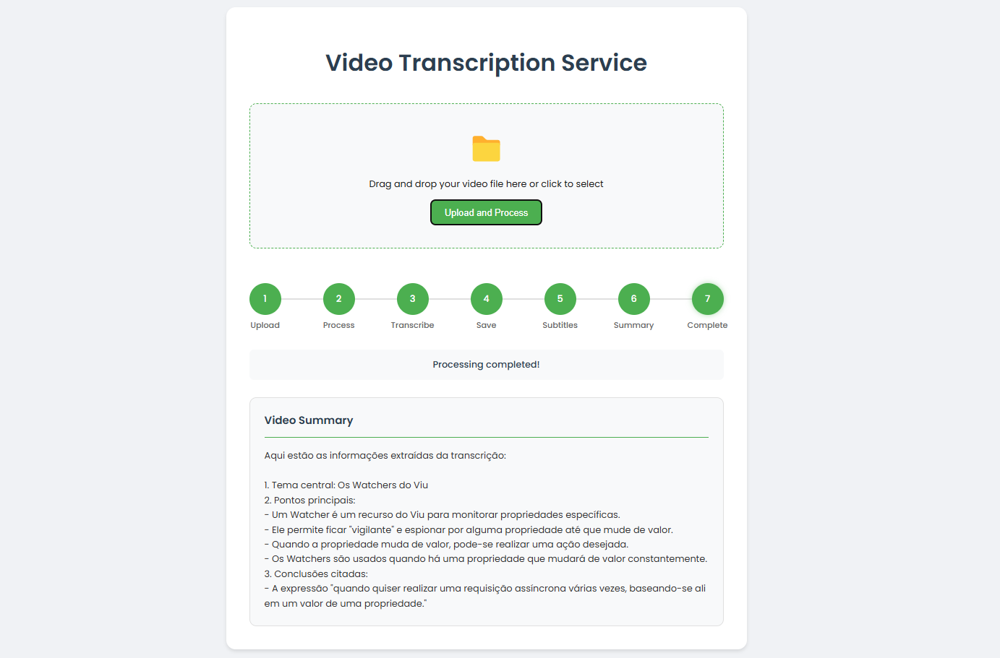

# Whisper AI Voice to Text + Ollama AI Chat



## Help

- [How to Install & Use Whisper AI Voice to Text](https://youtu.be/ABFqbY_rmEk)
- [OpenAI Whisper](https://github.com/openai/whisper)
- [Download Model #63](https://github.com/openai/whisper/discussions/63)
- [ffmpeg](https://www.ffmpeg.org/)
- [Best FREE Speech to Text AI - Whisper AI](https://youtu.be/8SQV-B83tPU)
- [How to Install & Use Whisper AI Voice to Text](https://youtu.be/ABFqbY_rmEk)

## Models

> https://github.com/openai/whisper/blob/main/whisper/__init__.py#L17-L32

## Start

### on local

```bash
python3 -m venv .venv;
. '.\.venv\Scripts\Activate.ps1'; # powershel
source .venv/Scripts/activate; # windows git bash
source .venv/bin/activate; # linux

python -m pip install --upgrade pip;
pip install -r 'requirements.txt';

python main.py;

# tiny
whisper --model_dir 'temp/models' --model tiny './code/audio.mp3' --output_dir 'temp' -f json --language 'pt';

# base
whisper --model_dir 'temp/models' --model base './code/audio.mp3' --output_dir 'temp' -f json --language 'pt';

# small
whisper --model_dir 'temp/models' --model small './code/audio.mp3' --output_dir 'temp' -f json --language 'pt';

# medium
whisper --model_dir 'temp/models' --model medium './code/audio.mp3' --output_dir 'temp' -f json --language 'pt';

# large
whisper --model_dir 'temp/models' --model large './code/audio.mp3' --output_dir 'temp' -f json --language 'pt';

# large-v2
whisper --model_dir 'temp/models' --model large-v2 './code/audio.mp3' --output_dir 'temp' -f json --language 'pt';

# turbo
whisper --model_dir 'temp/models' --model turbo './code/audio.mp3' --output_dir 'temp' -f json --language 'pt';
```

## FFMPEG

```sh
# converter para audio com corte de tamanho
ffmpeg -y -i video.mp4 -ss 00:00:13 -to 00:00:34 -c:v copy -c:a copy output_video.mp4 && ffmpeg -y -i output_video.mp4 audio.wav

# converter para audio sem corte de tamanho
ffmpeg -y -i video.mp4 audio.wav;

# converter para audio sem corte de tamanho alterando o bitrate
ffmpeg -y -i video.mp4 -b:a 10k audio.wav;

# juntar um video com uma legenda
ffmpeg -i video.mp4 -i aula.srt -c copy -c:s mov_text -metadata:s:s:0 language=pt -metadata:s:s:0 title=Portuguese aula_legendada.mp4 -y;
```

## Ollama

```ps1
# Install
winget install ollama;

# Download llama3.2
ollama pull "llama3.2";

# Run
ollama serve;
```